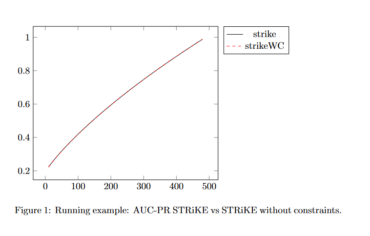
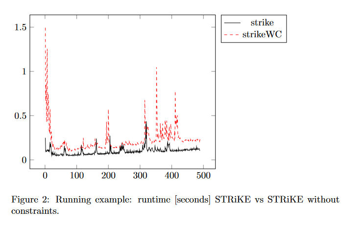
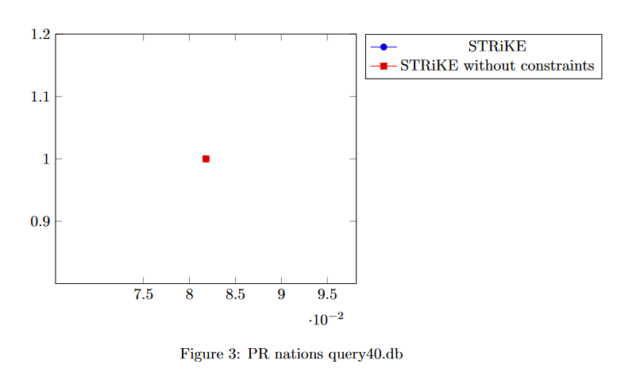
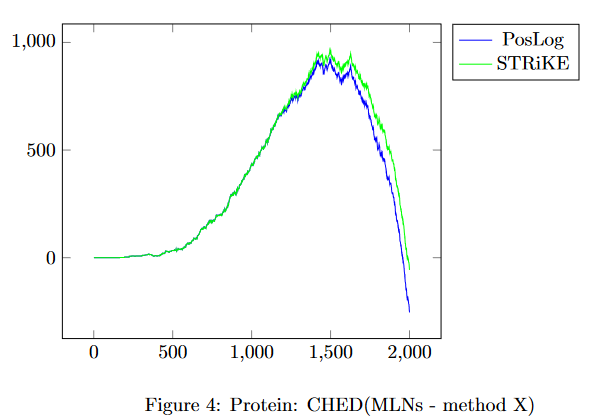

# STRiKE
This codebase contains implementation of a fragment-based rule inference engine accompanied by a heuristic beam-based rule-learning 
method that was published in [STRiKE: Rule-Driven Relational Learning Using Stratified k-Entailment](https://orca.cardiff.ac.uk/id/eprint/130911/1/ECAI2020_STRiKE.pdf) at ECAI'20 
and in *Relaxing Deductive and Inductive Reasoning in Relational Learning* (dissertation, CTU'24). 

If you'd like to cite us, please use the following bib-entry:
```
@article{svatovs2020strike,
  title={STRiKE: Rule-driven relational learning using stratified k-entailment},
  author={Svato{\v{s}}, Martin and Schockaert, Steven and Davis, Jesse and Ku{\v{z}}elka, Ond\v{r}ej},
  year={2020}
}
```

Installation
============
Having standard java installed on your machine is enough. Then, you may either use the fat jar or build one from scratch using 
all the dependencies -- [AUC-PR](https://www.biostat.wisc.edu/~page/rocpr.pdf), `Matching` by Ondřej Kuželka, and SAT4J. This 
codebase evolved from [Hypothesis Pruning](https://github.com/martinsvat/Pruning-Hypotheses) and include some ideas that were 
not published in the original paper.

Inference
=========
The core of the paper and the codebase are tightly connected with a general interference engine that allows one to infer 
sorted list of weighted rules in different manners:
- classical logical entailment (dropping out the weights)
- a [possibilistic logic approach](https://arxiv.org/pdf/1705.07095.pdf) (PosLog)
- one-step inference (1S) that applies only a single forward step of forward-chaining procedure with max-confidency aggregation (dropping out constraints)
- [*k*-entailment](https://arxiv.org/abs/1803.05768) that infers literals which are entailed by a fragment induced with up to $k$ constants (dropping out the weights)
- [STRiKE](https://orca.cardiff.ac.uk/id/eprint/130911/1/ECAI2020_STRiKE.pdf) (STRiKE) that invokes *k*-entailment on gradually larger list of rules (and hence less probable theories)

Let us start with an example:

$\Phi = \\{ \forall X giraffe(X) \Rightarrow animal(X), \forall X \forall Y  friends(X,Y) \Rightarrow friends(Y,X), \forall X \forall Y  friends(X,Y) \Rightarrow human(X) \\}$

$\Gamma = \\{ \forall X \lnot human(X) \lor \lnot animal(X) \\}$

$E = \\{ giraffe(liz), friends(ann, liz)\\} $

that models a world ($E$) with a single giraffe (liz) and her friend ann. We also have a theory that contains a Horn rules 
($\Phi$, for making predictions) and constraints ($\Gamma$, to keep integrity of the inferred facts).

Now, we can run different inference engines which produce different outputs:
- classical entailment runs into inconsistency and hence does not derive anything
- one-step inference usually ignores constraints in $\Gamma$, hence it would derive $\{animal(liz), friends(liz, ann), human(ann) \}$. In case that $\Phi$ is a list of weighted Horn-rules, the inferred fact would be accompanied by corresponding (max) weight of rules from which they were inferred.
- *k*-entailment needs the $k$ parameter to be set (i.e., the maximal number of constants that can be taken into account), hence it boils down to inferring all positive facts $\upsilon$ such that $E \cup \Gamma \cup \Phi \models_k \upsilon$, thus
- $k=1$ infers $\{animal(liz)\}$ -- it is also the single fact entailed by $k=2$ since all other possible facts, e.g., $human(liz)$, are blocked by the inconsistency that arises due to this fact and the constraint in $\Gamma$
- to see the full output of STRiKE, we need to firstly construct an ordered list of rules (together with constraints). For example, a list that starts with the constraint and continues as $\Phi$, would lead to deriving $\{animal(liz), friends(liz, ann)\}$ with weights annotated by particular weight from particular rules.   

For practical reasons, we allow only range-restricted, function-free, and constraint-free rules. However, we are not subject to only binary arity, which is the case of many knowledge-graph completion methods.

To apply the engine in this codebase for the above-mentioned cases, invoke the fat jar with the following parameters
```
java
    -Dida.pacReasoning.action=infer
    -Dida.pacReasoning.entailment=[classical|oneS|PL|PLWC|k|strike|strikeWC]
    -Dida.pacReasoning.entailment.k=2
    -Dida.pacReasoning.inputFolder=.\datasets\giraffe\
    -Dida.pacReasoning.theory=.\datasets\giraffe\theory.poss
    -Dida.pacReasoning.outputFolder=.\infer\giraffe\
    -jar STRiKE.jar
```
These predefined modes translates to apply the engine on the whole domain or fragments, stratified or non-stratified theory, and so on. 
Further, the suffix *WC* stands for dropping constraints in that run, so you don't have to create constraint-free theories in different files.
The engine than iterates over all *.db* files in the input folder and applies the given strategy with the theory and stores 
the result to the output folder. The constants in the db file starts with lower-case while variables in theory file starts with an 
upper-case (the only type of terms allowed in there). Finally, you may notice that in the inferred folder, there are two files 
-- one with the inferred facts, i.e. a `.db` file where a fact is
- $-1$ if was from the domain, or
- by `entailedByValue x` where `x` is the value it was predicted with, or
- occupies the whole line which means that a crisp (weight-free) inference method was used

and a second with runtime (`.db.time` with inference time in nanoseconds).

Another example is stored in `.\datasets\crosscountryski`. It is a (positive) variant of the *smoker* case in SRL -- we have database of 
friendships among people where one does cross-country skiing. We also have a rule saying that a friend of a cross-country ski-er 
also does cross-country skiing. You may play around with the inference method to see the impact of (limited) forward-chaining 
from classical entailment, through STRiKE with different $k$, all up to single-step. 

Experiments & Evaluation
========================

Both papers contain well detailed description to reproduce experiments. The data are stored in the `.\dataset\` folder (these 
are taken from [Alchemy](alchemy.cs.washington.edu/data/)). These are also prepared for AnyBURL format and so on -- you have 
to take into account that some versions take turtle notation, some not. The data produced during the experiments in the papers  
are stored in `.\experiments\`. Below, we provide a manual how to prepare data and evaluate STRiKE on arbitrary dataset (still, 
we assume constant-free and range-restricted sorted rule list, with capitalized variables, and grounded training and testing 
data).

Types
-----
In some cases, predicates may be typed -- then, each argument position is allowed to take into only particular type of constant 
(variable). This may come handy in cases that you there is such property in the data and so you exploit this knowledge into 
the rule learning process. 
```
java 
    -Dida.pacReasoning.action=typing
    -Dida.pacReasoning.input=.\datasets\nations\train.db.oneLine
    -Dida.pacReasoning.outputFolder=.\exp\nations\
    -jar STRiKE.jar
```

Learning Theory: Constraints
----------------------------

Now, we start learning domain theory, i.e., constraints for the theory, if we want to use them.
```
java
    -Dida.pacReasoning.action=learnConstraints
    -Dida.searchPruning.input=.\exp\nations\train.db.oneLine.typed
    -Dida.searchPruning.storeTo=.\exp\nations\constraints.txt
    -Dida.logicStuff.constraints.maxLiterals=2
    -Dida.logicStuff.constraints.maxVariables=2
    -Dida.logicStuff.constraints.maxPosLit=1
    -Dida.logicStuff.constraints.types=.\exp\nations\typing.txt
    -jar STRiKE.jar
```

Learning Theory - Dataset Subsampling
-------------------------------------

Next, we have to do one more thing before learning a rule list. In order to use our heuristic, we have to subsample the dataset, i.e.
```
java
    -Dida.pacReasoning.action=sampleDataset
    -Dida.pacReasoning.input=.\exp\nations\train.db.oneLine.typed
    -Dida.pacReasoning.outputFolder=.\exp\nations
    -Dida.pacReasoning.threshold=0.5
    -jar STRiKE.jar
```
which gives you two new files -- a sample of the training data (in `*.uniPSI.db`) and its complement (in `*.complement`) -- 
that are needed for our heuristic learner. We keep sampling of the dataset and the learning part in separate steps so you may 
learn different rule lists on the same subsampled data.

Learning Theory - Horn rule Learning
------------------------------------

Finally, we may start learning (predictive) Horn rules, i.e.
```
java
    -Dida.pacReasoning.action=learnRules
    -Dida.pacReasoning.input=.\exp\nations\train.db.oneLine.typed.uni0.5.db
    -Dida.pacReasoning.types=.\exp\nations\typing.txt
    -Dida.pacReasoning.output=.\exp\nations\ruleList.txt
    -Dida.pacReasoning.domainTheory=.\exp\nations\constraints.txt
    -Dida.pipeline.rounds=2
    -Dida.pipeline.beamSize=2
    -Dida.pipeline.depth=2
    -Dida.pipeline.maxVariables=3
    -jar STRiKE.jar
```
which runs a beam-search is invoced multiple times, each time adding a rule that improves log-likelihood of the data. It looks 
for rules with at most 2 literals (unsaturated, see [Pruning Hypothesis Space Using Learned Domain Theories](https://orca.cardiff.ac.uk/id/eprint/102358/7/Pruning_Hypotheses_ILP2017.pdf)), 
and at most 3 variables, with beam set up to 2. Looks for 2 rules for each predicate, in each iteration adding a single rule. 
There is an inner time limit for 30 second for a rule evaluation. Note that learning on this particular dataset might be quite 
slow due to the computation of saturations, which can be overcome by not providing constraints (domain theory) at the start of 
the learning.

Sure, you may construct a rule list by yourself, e.g., using AMIE, AnyBURL, or any other method you like. There are even few 
chunks of codes that transpose outputs of these to our format, however, their output may vary from version to version, so it 
is better you form a rule list on your own then using outdated codes. The only thing you should take care of is to add the 
`alldiff` predicate (with arbitrary arity) on all variable occurring in a rule, e.g., `ngoorgs3(1:V0, 1:V1), !intergovorgs3(1:V0, 1:V1), !relintergovorgs(1:V2, 1:V1), !@alldiff(1:V2, 1:V1, 1:V0)`.

Now, you may use the learned theory (constraints & sorted weighted rules) for inference as described in the *Inference* section. 
However, in order to follow the setting in the papers exactly, you need to subsample test data, i.e.
```
java
    -Dida.pacReasoning.action=sampleTest
    -Dida.pacReasoning.input=.\datasets\nations\test.db
    -Dida.pacReasoning.outputFolder=.\exp\nations\test-uniform
    -jar STRiKE.jar
```

Now, for instance, we may apply STRiKE on this dataset with $k=5$, i.e.
```
java
    -Dida.pacReasoning.action=infer
    -Dida.pacReasoning.entailment=strike
    -Dida.pacReasoning.entailment.k=5
    -Dida.pacReasoning.inputFolder=.\exp\nations\test-uniform
    -Dida.pacReasoning.theory=.\exp\nations\ruleList.txt.poss
    -Dida.pacReasoning.outputFolder=.\exp\nations\strike
    -jar STRiKE.jar
```
and STRiKE without constraints, i.e.
```
java
    -Dida.pacReasoning.action=infer
    -Dida.pacReasoning.entailment=strikeWC
    -Dida.pacReasoning.entailment.k=5
    -Dida.pacReasoning.inputFolder=.\exp\nations\test-uniform
    -Dida.pacReasoning.theory=.\exp\nations\ruleList.txt.poss
    -Dida.pacReasoning.outputFolder=.\exp\nations\strikeWC
    -jar STRiKE.jar
```

Evaluation
----------

We also provide utilities to evaluate predictions, so you may test your models against ours in the same way we did in the papers. 
The main idea is to provide ground truth of the data and the predictions, i.e.
```
java
    -Dida.pacReasoning.action=evaluate
    -Dida.pacReasoning.metric=[CHED|AUCPR|PR|time]
    -Dida.pacReasoning.groundTruth=.\datasets\nations\test.db
    -Dida.pacReasoning.testSamples=.\exp\nations\test-uniform\
    -Dida.pacReasoning.input=.\exp\nations\strike\;.\exp\nations\strikeWC\
    -jar STRiKE.jar
```
which runs either cumulative Hamming error distance, area under the precision-recall curve, precision-recall curve, or execution time 
for all the *.db* files found in the `ida.pacReasoning.input` -- this one contains paths to folders with predictions delimited by `;`. 
However, for PR curves, it is better to set up a sampled version of the evaluation by  `-Dida.pacReasoning.modulo=10` to get every 
query file divisible by `10`; otherwise, PR is computed for every single *.db* file and printed to stdout.

Hence, to get AUC-PR on the running example, run
```
java
    -Dida.pacReasoning.action=evaluate
    -Dida.pacReasoning.metric=AUCPR
    -Dida.pacReasoning.groundTruth=.\datasets\nations\test.db
    -Dida.pacReasoning.testSamples=.\exp\nations\test-uniform\
    -Dida.pacReasoning.input=.\exp\nations\strike\;.\exp\nations\strikeWC\
    -Dida.pacReasoning.modulo=10
    -jar STRiKE.jar
```
and obtain, after a little of TiKZ changes, the following image:


You may also visualize runtime in seconds
```
java
    -Dida.pacReasoning.action=evaluate
    -Dida.pacReasoning.metric=time
    -Dida.pacReasoning.groundTruth=.\datasets\nations\test.db
    -Dida.pacReasoning.testSamples=.\exp\nations\test-uniform\
    -Dida.pacReasoning.input=.\exp\nations\strike\;.\exp\nations\strikeWC\
    -jar STRiKE.jar
```


or PR curves 
```
java
    -Dida.pacReasoning.action=evaluate
    -Dida.pacReasoning.metric=PR
    -Dida.pacReasoning.groundTruth=.\datasets\nations\test.db
    -Dida.pacReasoning.testSamples=.\exp\nations\test-uniform\
    -Dida.pacReasoning.input=.\exp\nations\strike\;.\exp\nations\strikeWC\
    -Dida.pacReasoning.modulo=10
    -jar STRiKE.jar
```


Note that these are only illustrative plots from the running example. You may obtain the ones from papers by using data in 
`.\experiments\`. Finally, to compute cumulative Hamming error distance (CHED), you run 
```
java
    -Dida.pacReasoning.action=evaluate
    -Dida.pacReasoning.metric=CHED
    -Dida.pacReasoning.groundTruth=.\datasets\protein\test.db
    -Dida.pacReasoning.testSamples=.\experiments\protein\queries\
    -Dida.pacReasoning.input=.\experiments\protein\src-q_t-ICAJ.poss_k-0_em-A_l-PL_is-f_dd-f_cpr-f_scout-f_sat-none_ms-f_alg-support\;.\experiments\protein\src-q_t-ICAJ.poss_k-5_em-K_l-PL_is-f_dd-f_cpr-f_scout-f_sat-none_ms-f_alg-support\
    -jar STRiKE.jar
```

The main difference in this evaluation is that each input is compared with the first one (MLNs in this case). 
The modulo parameter does not work with this setup.